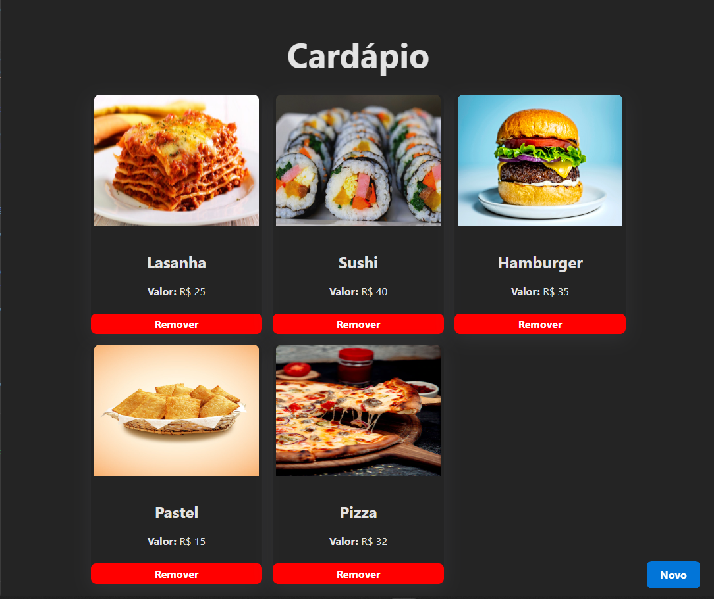

<h1 align="center"> 🍔 Cardápio Digital 🍔 </h1>

 Projeto pessoal de um simples protótipo de cardápio digital, que permite incluir novos produtos e fazer a exclusão do cardápio

 

  <a href="#-tecnologias">Tecnologias</a>

## Imagens e gifs do programa

  

 

## 🚀 Tecnologias

Esse projeto foi desenvolvido com as seguintes tecnologias:

### Backend:
- Java Spring e Spring MVC para criação do servidor
- Spring Data JPA para manipulação e persistência de dados
- Lombok
- Banco de dados PostgreSQL
### Frontend:
- React
- Typescript
- React Query

por Luan Araujo :wave:
